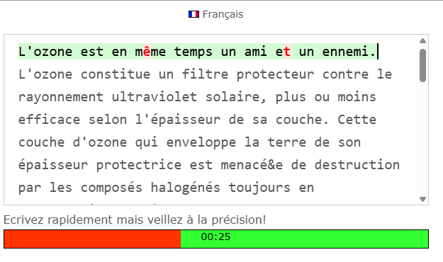

# Intersteno Typing Better Visual

1. [Preview](#preview)
2. [How to Install](#how-to-install)

## Preview

## How to Install

### 1.
Download the **tampermonkey** extension or an equivalent:
- Chrome: https://chrome.google.com/webstore/detail/tampermonkey/dhdgffkkebhmkfjojejmpbldmpobfkfo?hl=en
- Firefox: https://addons.mozilla.org/en-US/firefox/addon/tampermonkey/

### 2.

  
Click on the extension, then <b>Create New Script</b>

  

### 3.
Copy & paste the content of the [script.js](./script.js) file, and save it

### 4.

  
Now you can go on <a href="https://www.intersteno.it/page.php/id_primario-8/id_secondario-121/">https://www.intersteno.it/page.php/id_primario-8/id_secondario-121/</a> and toggle the script by clicking on the icon

  

